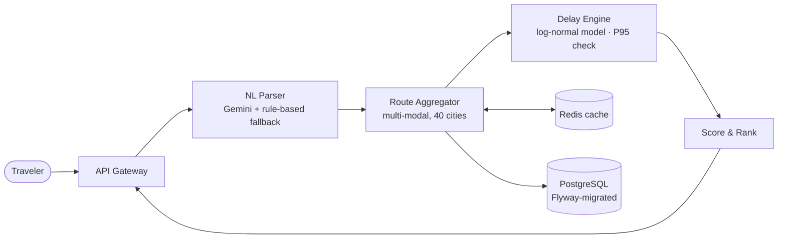
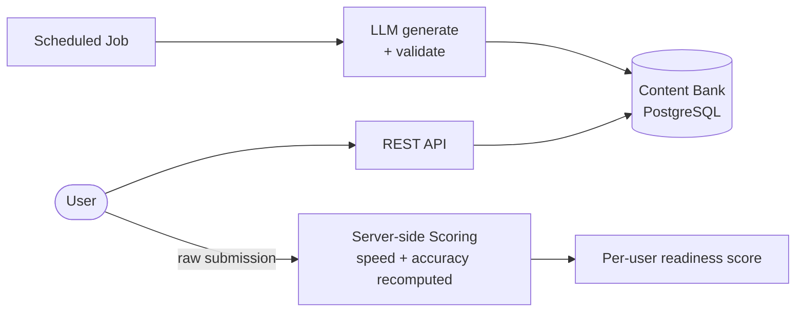
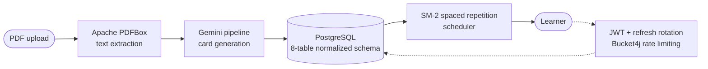

⛏ my last year of commits, mined block by block — refreshes itself daily · <b>watch it build: refresh the page</b>

  

---

## 🧩 About me

- 🔭 Backend developer focused on the **Java & Spring Boot** ecosystem — REST APIs, microservices, and the infrastructure around them.
- ⚙️ I care about the parts of backend most tutorials skip: **failure handling, caching, idempotency, CI/CD, and clean data models**.
- 🎓 **MCA @ Lovely Professional University** (2025–present) · B.Sc Computer Science, SIES College, Mumbai.
- 🏅 Certified: **Java Full Stack (JSpiders)** · HackerRank **[Problem Solving](https://hackerrank.com/certificates/ac1582d85d83)** & **[REST API](https://hackerrank.com/certificates/289140fb22d8)** (Intermediate).
- 📍 Navi Mumbai, India · 💼 Open to **backend / SDE internships and early-career roles**.

## 🛠️ Tech Stack

Java · Spring Boot · Spring Security · Spring Data JPA · Hibernate · REST APIs · SQL · PostgreSQL · Redis · Mockito · Docker · GitHub Actions · CI/CD

## 🚀 Projects

| | Project | What it does | Stack | |
|--|---------|--------------|-------|--|
| 🗺️ | **[JourneyOS](https://github.com/sanchitpdev/journeyos)** | Multi-modal travel planning engine — 7 microservices, delay-aware routing across a 40-city network | `Spring Boot` `PostgreSQL` `Redis` `Docker` | [Repo ↗](https://github.com/sanchitpdev/journeyos) |
| ⌨️ | **TypeDuo** | LLM-backed code-typing trainer — exercises pre-generated into a content bank, zero-latency serving | `Java 21` `Spring Boot 3` `PostgreSQL` | soon |
| 🧠 | **[FluxCards](https://github.com/sanchitpdev/FluxCards)** | Turns any PDF into AI-generated flashcards with spaced repetition | `Spring Boot 3` `Gemini API` `React` | [Live ↗](https://fluxcards-flashcard-engine.vercel.app/) |

<b>🗺️ JourneyOS — architecture & engineering decisions</b>

 

**Engineering decisions that matter:**
- **Delay intelligence, not just routing** — each leg's delay is modeled as a log-normal distribution from mode/duration baselines plus weather and holiday signals; every transfer is validated against the **95th-percentile worst case**, so connections a traveler would realistically miss get dropped before they're recommended.
- **Graceful AI degradation** — Gemini parses free-text trip requests, but a rule-based parser takes over on failure. The system never depends on an LLM being up.
- **7 services, one `docker compose up`** — the whole stack (services, PostgreSQL, Redis, React + TypeScript frontend) boots reproducibly.

<b>⌨️ TypeDuo — architecture & engineering decisions</b>

 

**Engineering decisions that matter:**
- **LLM off the hot path** — a scheduled job generates and validates exercises into a content bank ahead of time, so user requests are served instantly from PostgreSQL instead of waiting seconds on a live LLM call.
- **Cheat-proof scoring** — the server recomputes typing speed and accuracy from each raw submission; clients can't fake results.
- **Java 21 + Spring Boot 3**, stateless JWT auth, Flyway migrations, Docker Compose.

<b>🧠 FluxCards — architecture & engineering decisions</b>

 

**Engineering decisions that matter:**
- **JWT with refresh-token rotation** and Bucket4j rate limiting across 15+ REST endpoints — auth built like a production service, not a demo.
- **8-table normalized PostgreSQL schema** with Hibernate/JPA mappings and Flyway-managed migrations.
- **Deployed for real**: backend on Render, React frontend on Vercel — [try it live](https://fluxcards-flashcard-engine.vercel.app/).

More on my repos: [url-shortener](https://github.com/sanchitpdev/url-shortener) (Redis cache-aside, AWS ECS) · [order-processing-system](https://github.com/sanchitpdev/order-processing-system) (Kafka, DLQs) · [TaskForge](https://github.com/sanchitpdev/TaskForge) · [StayNest](https://github.com/sanchitpdev/StayNest)

## 🎮 Play Tic-Tac-Toe against my README

<!-- TTT:START -->
**You are ❌ — click an empty square to play.** A GitHub Action applies your move and the bot (⭕) answers in ~30 seconds.

|     |     |     |
|:---:|:---:|:---:|
| [⬜](https://github.com/sanchitpdev/sanchitpdev/issues/new?title=ttt%7Cmove%7C0&body=Just+press+%27Submit+new+issue%27+and+the+board+updates+in+about+30s.) | [⬜](https://github.com/sanchitpdev/sanchitpdev/issues/new?title=ttt%7Cmove%7C1&body=Just+press+%27Submit+new+issue%27+and+the+board+updates+in+about+30s.) | [⬜](https://github.com/sanchitpdev/sanchitpdev/issues/new?title=ttt%7Cmove%7C2&body=Just+press+%27Submit+new+issue%27+and+the+board+updates+in+about+30s.) |
| [⬜](https://github.com/sanchitpdev/sanchitpdev/issues/new?title=ttt%7Cmove%7C3&body=Just+press+%27Submit+new+issue%27+and+the+board+updates+in+about+30s.) | [⬜](https://github.com/sanchitpdev/sanchitpdev/issues/new?title=ttt%7Cmove%7C4&body=Just+press+%27Submit+new+issue%27+and+the+board+updates+in+about+30s.) | [⬜](https://github.com/sanchitpdev/sanchitpdev/issues/new?title=ttt%7Cmove%7C5&body=Just+press+%27Submit+new+issue%27+and+the+board+updates+in+about+30s.) |
| [⬜](https://github.com/sanchitpdev/sanchitpdev/issues/new?title=ttt%7Cmove%7C6&body=Just+press+%27Submit+new+issue%27+and+the+board+updates+in+about+30s.) | [⬜](https://github.com/sanchitpdev/sanchitpdev/issues/new?title=ttt%7Cmove%7C7&body=Just+press+%27Submit+new+issue%27+and+the+board+updates+in+about+30s.) | [⬜](https://github.com/sanchitpdev/sanchitpdev/issues/new?title=ttt%7Cmove%7C8&body=Just+press+%27Submit+new+issue%27+and+the+board+updates+in+about+30s.) |

🏆 Humans **0** · 🤖 Bot **0** · 🤝 Draws **0**
<!-- TTT:END -->

## 📊 GitHub Stats

## 🤝 Let's connect

I'm open to backend developer / SDE internships and early-career roles. If you work on backend systems or distributed architecture, I'd love to connect.

⚡ This README mines my commits into a Minecraft world, plays tic-tac-toe, and rebuilds itself daily — <a href="https://github.com/sanchitpdev/sanchitpdev">see how it works</a>

