---

## 🧩 About me

- 🔭 Backend developer focused on the **Java & Spring Boot** ecosystem — REST APIs, microservices, and the infrastructure around them.
- ⚙️ I care about the parts of backend most tutorials skip: **failure handling, caching, idempotency, CI/CD, and clean data models**.
- 🎓 **MCA @ Lovely Professional University** (2025–present) · B.Sc Computer Science, SIES College, Mumbai.
- 🏅 Certified: **Java Full Stack (JSpiders)** · HackerRank **[Problem Solving](https://hackerrank.com/certificates/ac1582d85d83)** & **[REST API](https://hackerrank.com/certificates/289140fb22d8)** (Intermediate).
- 📍 Navi Mumbai, India · 💼 Open to **backend / SDE internships and early-career roles**.

## 🛠️ Tech Stack

Java · Spring Boot · Spring Security · Spring Data JPA · Hibernate · REST APIs · SQL · PostgreSQL · Redis · Mockito · Docker · GitHub Actions · CI/CD

## 🚀 Featured Projects

<b>🗺️ JourneyOS — Multi-Modal Travel Planning Engine</b> <i>(click to expand)</i>

 

**7 Spring Boot microservices** behind an API Gateway running a parse → route → aggregate → score → rank pipeline for end-to-end journey planning across a 40-city network.

- **Delay-intelligence engine**: models per-leg delays as a log-normal distribution from mode/duration baselines plus weather and holiday signals, then validates every transfer against 95th-percentile worst-case delay — connections a traveler would likely miss get dropped.
- **Gemini API** natural-language trip parsing with a rule-based fallback, **Redis** caching, Flyway-migrated **PostgreSQL**, all in one Docker Compose stack with a React + TypeScript frontend.

`Java` · `Spring Boot` · `PostgreSQL` · `Redis` · `Docker` · `React`

<b>⌨️ TypeDuo — LLM-Backed Code-Typing Platform</b> <i>(click to expand)</i>

 

A code-typing practice platform where a **scheduled job pre-generates and validates exercises into a content bank**, so requests are served instantly instead of waiting on a live LLM call.

- **Server-side scoring** recomputes typing speed and accuracy from each raw submission so results can't be faked, with a per-user readiness score across difficulty levels.
- **Java 21 + Spring Boot 3**, stateless JWT auth, Flyway-migrated PostgreSQL, Docker Compose, React + TypeScript frontend.

`Java 21` · `Spring Boot 3` · `PostgreSQL` · `Docker` · `React`

<b>🧠 FluxCards — AI Flashcard Engine</b> <i>(click to expand)</i>

 

Turns any uploaded PDF into flashcards: an AI pipeline built on **Apache PDFBox + the Gemini API**, with Flyway-managed schema migrations.

- **JWT auth with refresh-token rotation** and Bucket4j rate limiting across 15+ REST endpoints in a layered service architecture.
- 8-table normalized **PostgreSQL** schema with Hibernate/JPA mappings; backend on Render, React frontend on Vercel.

`Spring Boot 3` · `Gemini API` · `PostgreSQL` · `React` · 🔗 **[Live demo](https://fluxcards-flashcard-engine.vercel.app/)**

More on my repos: [url-shortener](https://github.com/sanchitpdev/url-shortener) (Redis cache-aside, AWS ECS) · [order-processing-system](https://github.com/sanchitpdev/order-processing-system) (Kafka, DLQs) · [TaskForge](https://github.com/sanchitpdev/TaskForge) · [StayNest](https://github.com/sanchitpdev/StayNest)

## 🎮 Play Tic-Tac-Toe against my README

<!-- TTT:START -->
**You are ❌ — click an empty square to play.** A GitHub Action applies your move and the bot (⭕) answers in ~30 seconds.

|     |     |     |
|:---:|:---:|:---:|
| [⬜](https://github.com/sanchitpdev/sanchitpdev/issues/new?title=ttt%7Cmove%7C0&body=Just+press+%27Submit+new+issue%27+and+the+board+updates+in+about+30s.) | [⬜](https://github.com/sanchitpdev/sanchitpdev/issues/new?title=ttt%7Cmove%7C1&body=Just+press+%27Submit+new+issue%27+and+the+board+updates+in+about+30s.) | [⬜](https://github.com/sanchitpdev/sanchitpdev/issues/new?title=ttt%7Cmove%7C2&body=Just+press+%27Submit+new+issue%27+and+the+board+updates+in+about+30s.) |
| [⬜](https://github.com/sanchitpdev/sanchitpdev/issues/new?title=ttt%7Cmove%7C3&body=Just+press+%27Submit+new+issue%27+and+the+board+updates+in+about+30s.) | [⬜](https://github.com/sanchitpdev/sanchitpdev/issues/new?title=ttt%7Cmove%7C4&body=Just+press+%27Submit+new+issue%27+and+the+board+updates+in+about+30s.) | [⬜](https://github.com/sanchitpdev/sanchitpdev/issues/new?title=ttt%7Cmove%7C5&body=Just+press+%27Submit+new+issue%27+and+the+board+updates+in+about+30s.) |
| [⬜](https://github.com/sanchitpdev/sanchitpdev/issues/new?title=ttt%7Cmove%7C6&body=Just+press+%27Submit+new+issue%27+and+the+board+updates+in+about+30s.) | [⬜](https://github.com/sanchitpdev/sanchitpdev/issues/new?title=ttt%7Cmove%7C7&body=Just+press+%27Submit+new+issue%27+and+the+board+updates+in+about+30s.) | [⬜](https://github.com/sanchitpdev/sanchitpdev/issues/new?title=ttt%7Cmove%7C8&body=Just+press+%27Submit+new+issue%27+and+the+board+updates+in+about+30s.) |

🏆 Humans **0** · 🤖 Bot **0** · 🤝 Draws **0**
<!-- TTT:END -->

## 📊 GitHub Stats

## 🐍 Contribution Snake

<picture>
  <source media="(prefers-color-scheme: dark)" srcset="https://raw.githubusercontent.com/sanchitpdev/sanchitpdev/output/github-contribution-grid-snake-dark.svg" />
  <source media="(prefers-color-scheme: light)" srcset="https://raw.githubusercontent.com/sanchitpdev/sanchitpdev/output/github-contribution-grid-snake.svg" />
  
</picture>

## 🤝 Let's connect

I'm open to backend developer / SDE internships and early-career roles. If you work on backend systems or distributed architecture, I'd love to connect.

⚡ This README plays games, renders me in binary, and updates itself — <a href="https://github.com/sanchitpdev/sanchitpdev">see how it works</a>

